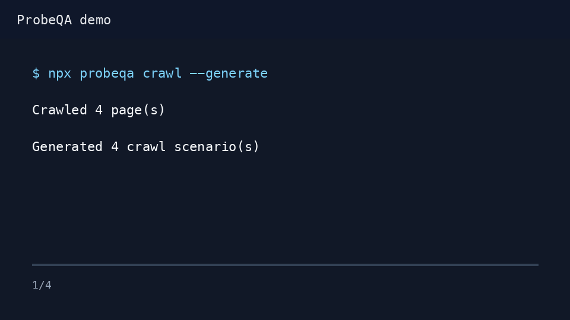

# ProbeQA

AI-ready Puppeteer QA harness for PR-end browser testing across any app repo.

It can be used by any AI agent, any developer, or any CI/local workflow that can run Node.

ProbeQA gives coding agents a repeatable QA loop: inspect the diff, generate browser edge-case scenarios, run the app like a user, and leave durable tests behind.

If you want AI coding agents to prove browser behavior before pushing code, star/watch the repo and share feedback in [Discussions](https://github.com/codewiser-io/probeqa/discussions).



## What This Is

This is a local-first open-source npm CLI for any app repo configured in `probeqa.config.json`.

It is not a hosted AI product and it is not a trained model. What exists now is:

- A Puppeteer runner that opens a real browser and clicks through flows
- A scenario format for PR-specific integration tests
- A crawler that maps reachable public routes and UI affordances
- A generator that reads changed files and creates scenario drafts
- An AI tester role in `AI_TESTER.md` that tells agents how to generate edge-case scenarios
- A place to keep those generated tests so they become part of integration QA

The "AI" part is the coding agent using the tester role before push: it reads the diff, thinks through edge cases, generates or writes Puppeteer scenarios, runs them headed/headless, and reports the result.

The open-source part is normal Node/Puppeteer code. Nothing external is required besides npm packages.

The next layer should be model-provider adapters that improve `qa:generate` with real LLM reasoning while keeping the runner vendor-neutral.

## Why Teams Use It

- Make AI coding agents prove changed browser flows before a PR is pushed.
- Turn one-off manual QA ideas into reusable integration scenarios.
- Keep QA local-first instead of paying for every experimental CI run.
- Capture screenshots, console errors, and network failures when a scenario breaks.
- Give teams a single lightweight convention that works across repos.

## Links

- Launch kit and sharing copy: [LAUNCH.md](LAUNCH.md)
- AI tester role: [AI_TESTER.md](AI_TESTER.md)
- Examples: [examples/](examples/)

## Setup

```bash
npm install -D probeqa
npx probeqa init
```

Configure target repos in `probeqa.config.json`, then start the target app stack separately.

```json
{
  "projects": [
    {
      "name": "App",
      "path": ".",
      "kind": "app",
      "baseUrl": "http://localhost:3000"
    }
  ],
  "scenariosDir": "probeqa/scenarios",
  "artifactsDir": "probeqa/artifacts",
  "runner": "puppeteer",
  "ignore": {
    "console": [],
    "network": []
  },
  "aiRefinement": {
    "enabled": false,
    "provider": "local",
    "endpoint": "http://localhost:11434/refine"
  }
}
```

Run the QA scenarios:

```bash
npx probeqa plan      # inspect changed files and proposed QA surface
npx probeqa audit     # find routes without ProbeQA scenario coverage
npx probeqa crawl     # crawl reachable same-origin pages into a route map
npx probeqa generate  # write a generated scenario draft
npx probeqa generate --refine --provider openai
npx probeqa run       # headless
npx probeqa run --runner playwright
AI_QA_HEADLESS=false npx probeqa run
npx probeqa list
```

Or add scripts to the consuming app:

```json
{
  "scripts": {
    "qa:plan": "probeqa plan",
    "qa:audit": "probeqa audit",
    "qa:crawl": "probeqa crawl",
    "qa:generate": "probeqa generate",
    "qa": "probeqa run",
    "qa:headed": "AI_QA_HEADLESS=false probeqa run"
  }
}
```

## App Repo Setup

Install ProbeQA in any app repo:

```bash
npm install -D probeqa
npx probeqa init
```

Use a config like:

```json
{
  "projects": [
    {
      "name": "Web App",
      "path": ".",
      "kind": "app",
      "baseUrl": "http://localhost:3000"
    }
  ],
  "scenariosDir": "probeqa/scenarios",
  "artifactsDir": "probeqa/artifacts"
}
```

Add scripts:

```json
{
  "scripts": {
    "qa:plan": "probeqa plan",
    "qa:generate": "probeqa generate",
    "qa": "probeqa run",
    "qa:headed": "AI_QA_HEADLESS=false probeqa run"
  }
}
```

Expected PR habit:

```bash
npm run qa:plan
npm run qa:audit
npm run qa:crawl -- --generate
npm run qa:generate
npm run qa:headed
npm run qa
```

The generated scenario is a draft. The AI or developer should tighten it into real clicks, role states, and assertions before merging.

## Configuration Options

`runner` defaults to `puppeteer`. Set `"runner": "playwright"` or pass `--runner playwright` to use Playwright without adding it as a required ProbeQA dependency. Install it in the app repo with `npm install -D playwright`.

`ignore.console` and `ignore.network` accept substring strings or `/regex/` strings for known benign browser noise. Defaults remain strict, with the existing Next.js HMR network exception kept out of failure reports.

`aiRefinement` is disabled by default. Enable it to refine generated scenario drafts through `openai`, `anthropic`, or a `local` HTTP endpoint. Missing API keys or unavailable local endpoints skip refinement and keep the deterministic generated scenario.

```json
{
  "ignore": {
    "console": ["ResizeObserver loop limit exceeded"],
    "network": ["/analytics\\.example\\.com/"]
  },
  "aiRefinement": {
    "enabled": true,
    "provider": "openai",
    "model": "gpt-4.1-mini"
  }
}
```

OpenAI uses `OPENAI_API_KEY` by default. Anthropic uses `ANTHROPIC_API_KEY`. Local adapters use `aiRefinement.endpoint` or `PROBEQA_LOCAL_AI_URL`.

## GitHub Actions Example

Run on pull requests and after merges to `main`:

```yaml
name: ProbeQA

on:
  pull_request:
  push:
    branches: [main]

jobs:
  browser-qa:
    runs-on: ubuntu-latest
    steps:
      - uses: actions/checkout@v4
      - uses: actions/setup-node@v4
        with:
          node-version: 20
          cache: npm
      - run: npm ci
      - run: npm run build
      - run: npm run start &
      - run: npx wait-on http://localhost:3000
      - run: npx probeqa run
```

For local-first teams, keep this workflow optional at first and require agents to run `npm run qa:headed` before pushing.

## Distribution

ProbeQA is distributed as an npm CLI package.

Recommended public path:

```bash
npm install -D probeqa
npx probeqa init
npx probeqa generate
npx probeqa run
```

It is not a cloud package right now. A cloud layer can come later for hosted artifacts, scheduled QA runs, team dashboards, and shared scenario intelligence. The core should stay local and open source so any AI agent can plug into it.

Publishing:

```bash
npm login
npm publish --access public
```

## Development Checks

ProbeQA uses Node's built-in test runner for package-level coverage:

```bash
npm test
npm run pack:check
```

`npm run pack:check` runs the test suite and syntax checks before producing the npm package dry run. The GitHub CI workflow runs the same check on pushes and pull requests.

## PR-End Rule For AI Agents

Before pushing every PR, the AI must either:

1. Add and run 3-7 Puppeteer scenarios for the changed user flows, or
2. Add the scenarios and report the exact blocker that prevented running them.

Scenarios live in the configured `scenariosDir`. Use `probeqa/scenarios/_template.mjs` after `probeqa init`, or run `npx probeqa generate --repo "Web App"` to create a draft from one configured project. Use `AI_TESTER.md` for the tester mindset.

Prioritize edge cases the normal unit tests miss:

- Auth redirects and role boundaries
- Empty, loading, error, and forbidden states
- Form validation and disabled-submit behavior
- Navigation between changed pages
- Cross-service behavior between frontend and backend
- Browser-only issues: focus, click targets, layout, console errors

Keep scenarios deterministic. Do not use production data or destructive actions unless the test environment is explicitly disposable.

## Self-Extending Loop

1. Code changes land locally.
2. `probeqa generate` reads the current diff for configured repos.
3. It writes a scenario draft under `scenarios/`.
4. The AI tester sharpens that draft into real clicks/assertions.
5. The scenario stays in the repo and becomes part of future integration QA.

This is intentionally local-first so teams can run the expensive browser checks before push or merge instead of paying for every CI attempt.

## Test Gap Audit

After ProbeQA is installed in an existing app, start with a route and edge-case audit:

```bash
npx probeqa audit
npx probeqa crawl --generate
```

1. List critical flows: signup, login, onboarding, billing, admin, core app workflow.
2. For each flow, create one scenario for happy path, empty state, forbidden state, invalid input, and slow/error backend.
3. Run headed first so the reviewer can watch the browser.
4. Keep only stable scenarios in `probeqa/scenarios`.

ProbeQA does not yet crawl the whole app and prove full coverage automatically. That should be a near-term feature.
